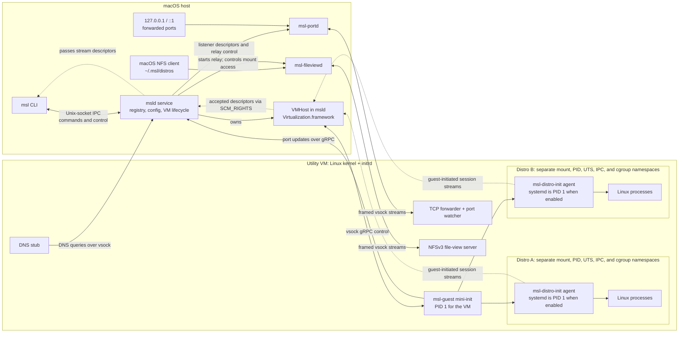

# Architecture

MSL provides a WSL-style Linux environment on macOS. This page describes its host and guest components, the shared VM design, and how MSL maps WSL features onto macOS. Planned work is tracked in the [project milestones](https://github.com/onexay/msl/milestones).

## Design choice: one shared utility VM

The open-source WSL implementation uses **one utility VM**:
- `mini_init` is PID 1 for the whole VM.
- Each distro gets **its own `init` in separate mount, PID and UTS namespaces**.
- The network namespace is shared, so all distros have one IP and localhost works across them.
- `/mnt/wsl` is shared between distros.
- Execution goes: session leader → relay → process, with stdio carried over hvsockets.

OrbStack uses the same model on macOS.

MSL uses the same model for three reasons:
- Virtualization.framework rarely gives freed guest RAM back to the host. With one VM per distro, idle distros each keep holding memory. One VM means one memory pool.
- Distro start and stop is near-instant, because it's a namespace rather than a VM boot.
- `--shutdown`, the `.wslconfig` resource limits and shared localhost all behave exactly as they do in WSL.

This design also has trade-offs:
- We write our own guest init. Containerization's multi-container support (`LinuxPod`) is experimental and doesn't support per-distro systemd.
- Isolation between distros is weaker, same as WSL.
- The whole design sits behind a `DistroRuntime` protocol, so a VM-per-distro backend could be added later.

## Architecture

When available, `launchd` holds the service socket and starts `msld` on the first connection. In development, test homes, and sessions without a GUI login, `msl` starts `msld` directly. The host uses vsock gRPC for VM control. For command sessions, the guest dials one-shot host ports; `msld` passes the accepted descriptors to `msl`, which copies the terminal or pipe data itself. Port forwarding and the Finder file view use separate relay processes so `msld` does not carry their data.

### Host (Swift, macOS 27 or later)
#### `msl` command-line tool
  1. `msld` starts the guest process and asks the guest to connect to a one-shot host vsock port. Each connection carries a per-session token and one stream: a PTY, or stdin, stdout, or stderr.
  2. `msld` passes the accepted vsock file descriptors to `msl` over its Unix socket using `SCM_RIGHTS` (`Reply.streams`). It retains its own descriptors until `msl` acknowledges the frame. This prevents XNU from emptying and shutting down a vsock-backed Unix socket while the descriptor is still in flight (`IPCConnection.sendRetaining`).
  3. `msl` copies bytes between the host's standard streams and the raw vsock streams. Guest-initiated connections do not trigger the VM stall seen with host-initiated connections when a reader stops ([#36](https://github.com/onexay/msl/issues/36)), so these streams need no framing.
  4. Stream completion travels over the control channel. Virtualization.framework can drop trailing bytes or lose a half-close when a guest closes a connection. After the process exits, the guest reports the byte count for each output (`Exited`, relayed as `Reply.ended`). `msl` reads exactly that many bytes, closes the streams, and returns the exit code reported by `msld`. The guest closes its descriptors after `msl` closes its copies.

  Exports use the same byte-count mechanism (`ExportDistroDone.bytes`). `msl --connect` uses the `OpenStream` `done` event and `Reply.streamEnd`. `SIGWINCH` and other signals travel as control messages. For first-run setup (OOBE), `msl` receives a second `.streams` set for the shell and stops copying stdin to the original session. Import, export, and install pass tar streams through `Reply.stream`; `msl --connect` receives two streams, one in each direction.

#### `msld` service
- A per-user LaunchAgent (`~/Library/LaunchAgents/dev.msl.msld.plist`, [#52](https://github.com/onexay/msl/issues/52)), socket-activated: launchd holds `msld.sock` and starts msld on the first connection, so it runs only on demand. The first `msl` that finds no msld writes the plist and bootstraps it in `gui/<uid>`. A development build, a test home (`MSL_HOME`), or a session with no GUI login (SSH) starts msld directly instead (detached, logging to `msld.log`). msld stops the VM after `vmIdleTimeout` and keeps running until logout, or until `msl --update` replaces it (launchd then starts the new one).
- On SIGTERM (logout, restart, shutdown, `launchctl bootout`), msld runs the `--shutdown` path with a 5 s stop grace: the distros stop, their disks are unmounted and flushed (`F_FULLFSYNC`), the VM powers off, and msld exits. The agent's `ExitTimeOut` is 30 s.
- Stores:
  - Registry (the Lxss equivalent): `~/Library/Application Support/msl/registry.json`, one entry per distro: GUID, name, state, default user, flags.
  - Global config: `~/.mslconfig`, the `.wslconfig` equivalent with the same INI keys and the same size-suffix and bad-file rules.
- VM setup:
  - virtio-blk data disk, a sparse raw image formatted as ext4 on macOS.
  - `VZVmnetNetworkDeviceAttachment` in shared (NAT) mode (macOS 26). It works with ad-hoc signing and only the virtualization entitlement. The subnet isn't pinned: `vmnet_network_configuration_set_ipv4_subnet` stops vmnet's DHCP from answering the kernel's `ip=dhcp`, and pinning would need static addressing in the guest. If vmnet is unavailable, msld falls back to `VZNATNetworkDeviceAttachment`.
  - `VZVirtioSocketDevice`.
  - virtiofs share of `/`.
  - `VZLinuxRosettaDirectoryShare`.
  - Memory balloon.
  - XHCI controller, for hot-attaching disks as USB mass storage.
- Entitlement: `com.apple.security.virtualization`. Ad-hoc signing for development; Developer ID plus notarisation for release.

### Guest (statically linked Rust)
- **Language and toolchain:** Rust. The guest runs as PID 1 and inside namespaces, so it needs `fork`/`setns`/`pivot_root` without a language runtime getting in the way. Rust also gives memory safety for code that parses input from the host, small static binaries, and direct prior art: the Kata Containers agent (which runs inside the VM, talks over vsock and spawns into namespaces) and youki.
  - Target `aarch64-unknown-linux-musl` only (arm64 first). x86_64 matters only as a Rosetta *test input*, never as a build target. Build with plain `cargo` on macOS: musl's startup files and libc come with the rustup target, and linking uses `rust-lld` (set in `.cargo/config.toml`). No zig or C cross-toolchain is needed.
  - **Pure-Rust dependencies only, no C code.** This is what keeps the cross build toolchain-free.
  - Release profile: `opt-level="z"`, `lto="fat"`, `codegen-units=1`, `panic="abort"`, `strip=true`. Keep musl's malloc; the agent allocates little. If profiling shows a problem, switch to a pure-Rust allocator.
  - **One multi-call binary**, `msl-guest`, which acts as `msl-mini-init`, `msl-distro-init` or `mslpath` based on `argv[0]`, like WSL's `/init`. Target size is about 4–7 MB.
  - The initrd holds only this binary.
  - It is bind-mounted read-only as `/init` into each distro, so installing a distro changes nothing inside it.
- **Crates** (`guest/Cargo.toml`):
  - `nix` and `libc` for syscalls, mounts, `pivot_root` and namespaces;
  - `tokio` on a **current-thread runtime**, which keeps memory low and keeps the process single-threaded, so `setns`/`unshare` stay safe;
  - `tokio-vsock`;
  - `tonic` + `prost` for gRPC;
  - `nfsserve` for the NFS server behind `~/.msl/distros` (`intaglio`, `async-trait` and `tracing` are used by msl's NFS code);
  - `tar`, `flate2` (`miniz_oxide` backend), `lzma-rs` and `ruzstd` for import/export streams (all pure Rust);
  - `serde_json` for the settings mini-init passes to each distro's init.
- **No crate needed:**
  - Network setup: the kernel configures `eth0` by DHCP (`ip=dhcp` on its command line), and the guest brings `lo` up with an `ioctl`.
  - `wsl.conf`: a small INI reader in `guest/src/config.rs`.
- **Process-model rules:**
  - mini-init starts `msl-distro-init`, which creates the distro's mount, UTS, IPC, PID, and cgroup namespaces. The distro process sets mount propagation, pivots into the root filesystem, then starts the agent or systemd. User processes are spawned with `Command::pre_exec` to set the session, controlling terminal, credentials, and supplementary groups from the distro's `/etc/group`.
  - **Only async-signal-safe calls** are allowed between `fork` and `exec`. Fork before starting the tokio runtime, or from a dedicated spawn path that doesn't allocate.
  - **systemd distros:** `msl-distro-init` forks. The parent execs `/sbin/init` (systemd becomes PID 1 of the namespace) and the child stays as the agent, re-parented to systemd. Without systemd, `msl-distro-init` is PID 1 itself.
  - **Reaping:** a single reaper thread blocks in `waitpid(-1)` and hands exit statuses to waiters by PID; with no children it sleeps on an eventfd that a SIGCHLD handler bumps (a new child can be an orphan reparented to it). Nothing else waits on children. The agent sets `PR_SET_CHILD_SUBREAPER` when it isn't PID 1.
  - Sessions run as Tokio tasks inside the distro agent; MSL does not create a separate relay process for each command. The guest also runs system services such as systemd when configured.
- **`msl-mini-init`** (PID 1):
  - mounts the base filesystems and the data disk (`/var/lib/msl/distros/<guid>/rootfs`);
  - sets up networking and DNS;
  - registers binfmt for Rosetta (x86_64 ELF only);
  - on request, starts `msl-distro-init` for that distro; it creates the namespaces and pivots into the distro root;
  - handles import/export as tar streams, `--mount`, and the debug shell.
- **`msl-distro-init`**, one per distro, using the same multi-call binary as mini-init:
  - parses `/etc/msl.conf`, falling back to `/etc/wsl.conf` so existing distros work unchanged;
  - automounts the macOS filesystem at `/mnt/macos` (a bind of the VM-wide virtiofs mount; no uid mapping needed);
  - optionally boots systemd and runs `boot.command`;
  - generates `/etc/hosts`, `/etc/resolv.conf` and the hostname;
  - runs each `msl` invocation as a session task: a PTY or pipes copied to vsock streams it dials back to the host (raw);
  - runs the localhost port watcher: a sock_ops BPF program on the root cgroup (`portwatch.rs`, raw instructions) sees every TCP `listen` and every listener closing and wakes it through a ring buffer, and it then rescans `/proc/net/tcp{,6}`. Without `CONFIG_CGROUP_BPF` (a custom kernel) it polls every 500 ms instead.
  - When invoked as `mslpath`, it translates paths (`-u/-w/-m/-a`, with `-w` producing a macOS path).
- **Protocol:** gRPC over vsock. The `.proto` files in `core/proto/` are the single source of truth: the host uses code generated by grpc-swift, and the guest uses code generated by `tonic-build`/`prost-build` in `build.rs`. Stdio uses raw vsock streams, one port per session stream, so bytes aren't framed through gRPC.
- **Kernel:**
  - Apple's 6.18 config (`base.config` in [msl-kernel](https://github.com/onexay/msl-kernel), extracted from the kernel `container` ships) plus `msl.fragment`. It already has binfmt_misc, namespaces, overlayfs, bpf, virtiofs and vsock; the fragment adds XHCI/usb-storage, quota and nfsd, and switches to 16 KiB pages to match the host. With 4 KiB guest pages, Virtualization.framework's 4 KiB IPA granule path corrupts guest kernel memory when macOS evicts VM memory under pressure ([#48](https://github.com/onexay/msl/issues/48)).
  - msl-kernel's `build.sh` builds it inside a Debian container using Apple's `container`; CI builds releases, and msl pins one (`kernel/release.tag`).

### Feature mapping (WSL → MSL)
| WSL | MSL |
|---|---|
| Distro storage | One sparse ext4 image per distro, `<location>/ext4.img` (256 GiB or `defaultVhdSize`/`--vhd-size`, never more than the macOS volume), with the distro's root at the filesystem root as in `ext4.vhdx` ([#50](https://github.com/onexay/msl/issues/50)). msld never serves disk I/O. The VM boots with every registered distro's image attached as virtio-blk (`VZDiskImageStorageDeviceAttachment`, `.full`: guest flushes become `F_FULLFSYNC`), up to 19 (`DistroDisk.maxBootDisks`: VZ refuses to start MSL's VM with more than 20 virtio-blk disks) and the default distro first; mini-init finds each by its virtio serial (`d0`, `d1`, …). virtio-blk can't be hot-plugged, so a disk that appears while the VM runs (an install, an import, a `--move` to another volume, a `--resize`) is handled by `DistroDisks`: if no distro runs, msld restarts the VM to attach it at boot (about 1.5 s); otherwise mini-init mounts it through a loop device (direct I/O, autoclear) over the virtiofs share of the Mac's `/` until the next boot. virtiofs turns a guest flush into a plain `fsync`, not `F_FULLFSYNC`, and random I/O is 6 to 19 times slower than virtio-blk (docs/dev/progress.md, 2026-09-30), so msld does `F_FULLFSYNC` on a loop-mounted image when it's detached and when the VM stops. A disk attached at boot is used again only while its path is the same file (device, inode) of the same size. Either way mini-init checks the ext4 UUID recorded in the registry, runs `e2fsck`/`resize2fs` when needed and mounts it at `/run/msl-disks/<id>/rootfs`. Distros from before #50 stay directories on the shared `data.img` until `--move`. |
| `.vhdx` import and `--mount` | `--import --vhd` copies a raw ext4 image to `<location>/ext4.img`; `--import-in-place` uses it where it is; `--export --vhd` clones the image. `--mount` hot-attaches raw or ext4 images as USB mass storage. |
| `--install` | Uses **Microsoft's `DistributionInfo.json` `Arm64Url` entries** directly, so `.wsl` tarballs work as they are. `--from-file`, `--name`, `--location` and `--no-launch` are supported. `wsl-distribution.conf` OOBE is honoured; shortcut and terminal sections are ignored. Override with `MSL_DISTRIBUTION_LIST_URL`. |
| x86_64 distros and programs | Unsupported. MSL uses an arm64 Linux kernel; it does not emulate an x86_64 system. Rosetta integration hooks do not make x86_64 distro images or programs supported. |
| `/mnt/c` and DrvFs | `/mnt/macos` over virtiofs (`automount.root` still applies). |
| `\\wsl.localhost\<distro>` | A userspace NFSv3 server in mini-init (adapted from `nfsserve`, BSD-3) exports `/run/msl-view`, one bind mount per distro **name**. msld mounts each distro separately as the user (`"<nfs.sock>:/<name>"` at `~/.msl/distros/<name>`, browsable, `nfc`). `msl-fileviewd` accepts on that socket and relays each connection over a framed vsock stream that `msld` opens and passes it (`RelayMessage`, as for `msl-portd`), so `msld` never carries file data; `msld` keeps mounting, and restarts `msl-fileviewd` if it dies (the mounts reconnect to the same socket). `mount_nfs` takes a Unix socket as the host in angle brackets plus `mountport=<path>` (undocumented, in Apple's NFS source); `fileViewTransport = tcp` uses a `127.0.0.1` port instead. The kernel connects as root and sends MOUNT as uid 0, so `msl-fileviewd` filters each RPC call on the way in (`RPCFilter`): AUTH_SYS uid must be the user's or 0, MOUNT only while msld runs `mount_nfs` (msld opens that window with `RelayMessage.mountWindow` and waits for `msl-fileviewd` to confirm it), and denied calls get an `AUTH_ERROR` reply (#1). Mounting the guest's IP over vmnet instead was rejected: any local user can connect from a "privileged" source port on macOS (non-root binds below 1024 on the wildcard address), so only the AUTH_SYS uid, which the client sets, would protect the files. Finder lists every distro under its own name in Locations, with the distro's logo (`[shortcut] icon` from `wsl-distribution.conf`, converted to `.VolumeIcon.icns`). macOS metadata (`.DS_Store`, AppleDouble `._*`, volume and folder icons) is kept in guest memory (`nfsview.rs`), so copies with extended attributes work and Linux never sees the files. Mounts follow the registry and are removed on shutdown; available while the VM runs. New files inherit the parent directory's owner. |
| Running Windows `.exe` from Linux | **Not supported (decided).** There is no Mach-O binfmt, no `mac` command, and macOS paths are never added to `PATH`. Every binary name therefore resolves only to Linux, so npm/node-gyp, autotools and similar builds can only find Linux toolchains. `[interop] enabled` and `appendWindowsPath` are parsed and ignored, and a Mach-O file fails with `Exec format error`. |
| `WSLENV` | `MSLENV`, **one-way (macOS → Linux) only**, with the `/p` and `/l` flags. `/u` is implied; `/w` is ignored. |
| `/mnt/macos` ownership | **Nothing to do.** Apple's virtiofs reports files as owned by the calling UID, and macOS enforces permissions as the macOS user. So any Linux UID, including the distro's usual 1000, can use `/mnt/macos`, and git's ownership checks pass. Idmapped mounts aren't supported on virtiofs (`EINVAL`) and aren't needed. `automount` `uid/gid/umask` are parsed and ignored. Docs recommend building in the distro's ext4 home for speed and case sensitivity. |
| cwd inheritance | The macOS cwd is translated to `/mnt/macos/...`. `--cd` accepts Linux paths, `~` or macOS paths. |
| Localhost forwarding (NAT) | The guest streams its listening TCP ports (`MiniInit.WatchPorts`); `msld` binds `127.0.0.1`/`::1` for each (skipping ports in use on macOS). `msl-portd`, like `wslrelay.exe`, accepts the connections and copies their bytes: `msld` starts it with the first forwarded port and passes it the listening sockets, and for each connection opens a framed vsock stream to the guest forwarder and passes that (`PortRelayMessage`, over a socketpair on its fd 3). `msld` keeps its descriptor of each stream until `msl-portd` reports it closed: releasing it earlier lost connections under load. `msl-portd` has no entitlements; it exits once `msld` closes its control socket (no ports left, the VM stopped, or `msld` exited) and its last connection has ended, and `msld` starts it again if it dies. `host.internal` in the generated `/etc/hosts` points at the vmnet gateway. |
| `dnsTunneling` | Guest stub at `10.255.255.254:53` (UDP+TCP) relays queries over vsock; `msld` answers with `DNSServiceQueryRecord` (mDNSResponder), so VPN split DNS, `/etc/resolver`, `.local` and the macOS hosts file work. Loopback/link-local answers are dropped. `[msl2] dnsTunneling=false` falls back to vmnet DNS. |
| vsock flow control | Virtualization.framework's vsock device stalls every vsock connection (and, at worst, a vCPU) if the host stops reading a **host-initiated** connection; guest-initiated ones are unaffected ([#36](https://github.com/onexay/msl/issues/36), re-measured in [#57](https://github.com/onexay/msl/issues/57)). Session streams, import/export tar streams and `msl --connect` (VS Code's managed pipes) are guest-initiated and raw, and msl reads and writes them itself. Each carries one direction only: VZ drops data still on its way to the host when the host has half-closed a connection and the guest then closes it, as Apple's vminitd avoids with a port per stdio stream. The guest copies with read/write, not `std::io::copy` (into a pipe that uses splice(2), which holds the pipe's lock while it waits for the socket and can leave an exiting process in `pipe_release`). Streams the host still opens (localhost forwarding and the file view) use credit framing (`guest/src/framed.rs`, `core/MSLCore/FramedBridge.swift`; 1 MB window), so receivers always drain their socket. |
| `nestedVirtualization` | `VZGenericPlatformConfiguration.isNestedVirtualizationEnabled` when the Mac supports it (M3 or later, macOS 15); the kernel has KVM, so `/dev/kvm` works in the VM. The platform also carries a `VZGenericMachineIdentifier` kept in `machine-identifier`, so the VM keeps one identity across boots. |
| `autoMemoryReclaim` | **No effect on macOS**: VZ's balloon doesn't release pages to the host (measured). Memory comes back when the VM exits after `vmIdleTimeout`. See [#37](https://github.com/onexay/msl/issues/37). |
| Error codes | The `Error code: Msl/…` line (wsl.exe prints `Wsl/…`) is only shown with `MSL_ERROR_CODES=1`; by default msl prints just the message. |
| `--set-version 1`, `--enable-wsl1`, `--inbox`, `--legacy`, `--system`, WSLg, GPU | Accepted by the parser and return an "unsupported on macOS" error in WSL's error format. |
| `--debug-shell` | Root shell (BusyBox) in the VM's root namespace. mini-init also serves the `Agent` service for it. |
| `--mount`/`--unmount` | Image files (or `/dev/diskN`, which needs root) are hot-attached as USB mass storage and mounted at `/mnt/msl/<name>` in every distro (a shared mount, propagated as a slave into running distros). `--bare`, `--name`, `--type`, `--options` and `--partition` are supported. |
| `--manage --compact` / `--resize` / `--move` | `--compact` runs FITRIM on every mounted disk (and every shutdown trims), so the images shrink on macOS. `--resize` grows a disk offline, because the formatter's `sparse_super2` rules out online resize: msld detaches the stopped distro's disk and makes the file larger, and mini-init runs the initramfs's static `e2fsck -f -p` and `resize2fs` before mounting it again (after a VM restart, or on a loop device, since the virtio-blk disk keeps its boot size). For `data.img`, msld stops the VM and the grow happens at the next boot. It never shrinks. `--move` renames the image (or copies it across volumes); a distro on `data.img` is copied onto a new disk by mini-init (`MigrateDistro`). |
| `--update [--pre-release]`, `--uninstall` | `--update` reads a release manifest (a channel URL baked in by `scripts/package.sh`, or `MSL_UPDATE_URL`), verifies the SHA-256, stops the service, and replaces files atomically. The old `msld` exits once replaced. `--uninstall` removes the program files and keeps distributions and settings. Both refuse on development builds. |

### Distro compatibility

MSL boots WSL root filesystem images with its own arm64 Linux kernel. Its online installer uses the arm64 image URLs in Microsoft's `DistributionInfo.json`. MSL does not emulate an x86_64 system and does not support x86_64-only distro images or x86_64 programs. The optional Rosetta share and binfmt registration are not a supported x86_64 execution path; x86_64 support remains deferred in [issue #40](https://github.com/onexay/msl/issues/40).

The guest `compat` layer runs at each distro start. It adapts selected WSL behaviors without repacking the source image. Systemd units and network link files are masked in the distro's runtime filesystems as described below:
- **Windows-only systemd units** are runtime-masked at each distro start (`/run/systemd/system/<unit>` → `/dev/null` on the distro's msl-owned tmpfs), so the image itself is never modified.
  - The initial list is `wsl-pro-service.service` (Ubuntu Pro for WSL), `console-getty.service` and `getty@tty1.service`. The gettys fight over the shared VM console; Debian goes `degraded` because of them.
  - The list lives in `guest/src/compat.rs` (`MASKED_UNITS`).
- **WSL detection is left off.** msl sets neither `WSL_DISTRO_NAME` nor `WSL_INTEROP`, and it does not put `microsoft` in `/proc/version`. Distro scripts therefore take their non-WSL code paths.
  - msl sets `MSL_DISTRO_NAME` instead.
- **`wslu`** (`wslview`, `wslvar`, …) is left as it is. It only fails when someone invokes it.
  - `/usr/bin/wslpath` is not overridden. `mslpath` is provided as `/usr/bin/mslpath` → `/run/msl/init` (the multi-call binary), the same way WSL provides `/usr/bin/wslpath`. It is the only file msl adds to an image.
- **First run (OOBE) and user creation:**
  - If `wsl-distribution.conf` defines `oobe.command` (for example Ubuntu's `wsl-setup`), msl runs it on the first interactive start, as WSL does.
  - The OOBE runs with `WSL_DISTRO_NAME=<name>` set **in its environment only**. Ubuntu's `wsl-setup` uses `set -u` and aborts without it; its `powershell.exe` calls fail harmlessly.
  - If it's missing or exits non-zero, msl uses its **own OOBE**: prompt for a username (defaulting to the macOS short name), create it as UID 1000, add it to the sudo/wheel group, and set it as the default user.
  - OOBE commands that only add Windows wording are replaced by msl's built-in OOBE (`guest/src/compat.rs` `OOBE_OVERRIDES`; currently Debian's `oobe.sh`).
- **cloud-init:** Ubuntu's is `disabled-by-generator` on msl, so no override is needed.
- **Interface name:** the NIC stays `eth0`. The kernel command line has `net.ifnames=0`, but systemd 259+ detects the distro's pid namespace as a container and then reads boot options from PID 1's arguments instead. So `99-default.link` is also runtime-masked (`/run/systemd/network/99-default.link` → `/dev/null`; `MASKED_LINKS` in `guest/src/compat.rs`), unless the image has its own in `/etc/systemd/network`.
- **Readiness:** a systemd distro is reported `Running` only after `/run/systemd/private` exists and `systemctl is-system-running --wait` has returned.
- **Stopping** (`--terminate`, idle timeout, `--shutdown`) is clean. A systemd distro gets `SIGRTMIN+4` and powers off, so services and journald close their files. Otherwise every process in the distro's cgroup gets `SIGTERM`, and the namespace ends once only msl's own processes are left. Anything still running after 10 s is killed with the pid namespace. `--shutdown --force` stops the VM immediately. Stopping also removes the distro's cgroup tree (`msl/<name>`); otherwise a restart fails with `EBUSY`.

## Repo layout

See the code layout table in [CONTRIBUTING.md](../CONTRIBUTING.md#code-layout).
